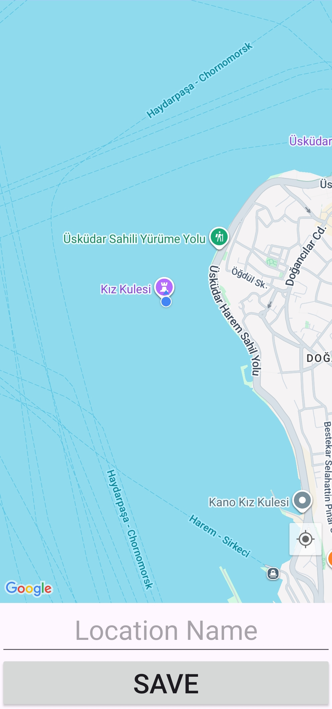

# Travel Book (Android • Java)

A simple, clean Android app to save, list, view, and manage your favorite places on a Google Map. Built with Java, Room, RxJava3, ViewBinding, and Material Design.

## Features
- Save places by long‑pressing on the map and naming them
- See your current location with a convenient My Location button
- Browse saved places in a RecyclerView list
- Tap a place to view it on the map with a marker
- Delete a saved place with confirmation
- Runtime permission handling for fine location

## Tech Stack
- Java, AndroidX, Material 3
- Google Maps SDK for Android
- Room (Entity/DAO/Database) + RxJava3 (Flowable/Completable)
- ViewBinding
- Min SDK 24, Target/Compile SDK 36

## App Structure
```
app/src/main/java/com/receparslan/travelbook/
  model/          # Room entity (Location)
  roomDB/         # Room database + DAO
  recycler_adapter/ # RecyclerView adapter
  views/          # Activities (MainActivity, MapsActivity)
app/src/main/res/
  layout/         # action_bar, activity_main, activity_maps, recycler_row
  values/         # strings, themes
  xml/            # backup/data extraction rules
```

## Screenshots
| List Screen                                                            | Detail Screen                                                              | Add Screen                                                           |
|------------------------------------------------------------------------|----------------------------------------------------------------------------|----------------------------------------------------------------------|
|  |  |  |

## Setup
1) Prerequisites
   - Android Studio (Giraffe or newer recommended)
   - Android SDK 24+
   - A Google Maps API key with Maps SDK for Android enabled

2) Add your Maps API key
   - This project uses the Secrets Gradle Plugin. Add your key to `local.properties` (not committed):
    ```
    MAPS_API_KEY=YOUR_ANDROID_MAPS_API_KEY
    ```
   - The manifest reads it via:
    ```
    <meta-data
        android:name="com.google.android.geo.API_KEY"
        android:value="${MAPS_API_KEY}"/>
    ```

3) Sync and run
   - Open the project in Android Studio and press Run, or build from terminal on Windows PowerShell:
    ```pwsh
    # Build debug APK
    ./gradlew assembleDebug

    # Install on a connected device/emulator
    ./gradlew installDebug
    ```

## Usage
- Grant location permission when prompted
- Press the My Location button to center on you
- Long‑press on the map to drop a marker, enter a name, and Save
- Tap a list item to open the place on the map; use Delete to remove

## Notes
- Database: Room with a single `Location` entity (`id`, `name`, `latitude`, `longitude`)
- Reactive: DAO exposes `Flowable`/`Completable`; UI observes on main thread
- ViewBinding enabled for type‑safe view access

## License
This project is licensed under the MIT License. See `LICENSE` for details.
